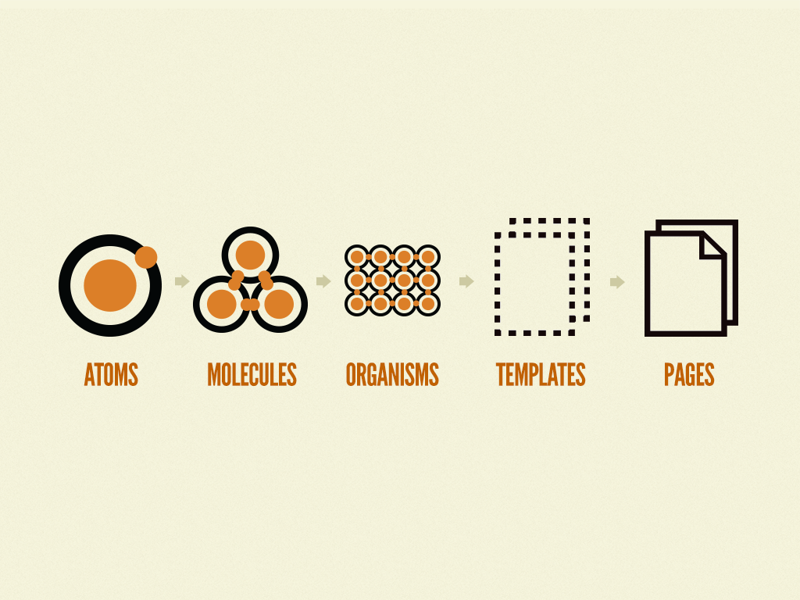

# Angular atomic design

This project is an angular template of atomic design

# Concept

## Description

- Atoms: Dumb components (we cannot call any service or conditional (intelligent) expression it is only for displaying
  info that's all and doesn't have a unit test it has a storybook to display forms that can be taken with the props (
  inputs))
- Molecules: intelligent components group of Atoms(you can call services and conditional expressions and it can have a
  unit test if it is intelligent or sotrybook if it has inputs and it is not intelligent)
- Organisms: intelligent components group of Molecules(you can call services and conditional expressions and it can have
  a unit test if it is intelligent or sotrybook if it has inputs and it is not intelligent)
- Templates: intelligent components group of Organisms and layout Designs(you can call services and conditional
  expressions and it can have a unit test if it is intelligent or sotrybook if it has inputs and it is not intelligent)
- Pages: Generally used to group common components like header and footer with internal templates (pages are located in
  modules)

